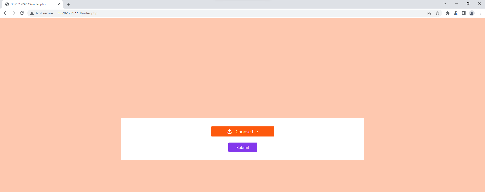

# Access Denied CTF 2022

# **Safe Upload**

Ở chall này ta có một website đơn giản cho phép ta upload file ảnh lên



Có thể thấy server không dựa vào `mime-type` hay `file extension` để xác định kiểu file, do ta đã đổi đuổi thành `.png` và content-type thành `image/png`→ khả năng xác định kiểu file dựa vào `Magic bytes`


Ta có thể giải quyết bằng cách up một file PNG, xóa gần hết nội dung và chỉ để vài bytes đầu cho nó check, phần nội dung sau sửa thành code `php` và đổi đuôi file thành `.php`


Gửi request GET đến file `php` vừa upload, tìm và đọc flag.


<aside>
🚩 accessdenied{php_bu7_n07_php_f1l3_74a148ef}

</aside>

# **Hack Wiki**

Check qua website, thấy ta được chọn một mảng bất kì và xem thông tin về nó


Chọn bừa một mảng và ấn submit, dùng Burp để đọc gói tin request, thấy có param `class=reverse_engineering.php`


Có thể server sử dụng `include($_POST['class'])` để hiển thị nội dung file php tên là `reverse_engineering.php`

Gửi payload `./reverse_engineering.php` và thấy file vẫn được hiển thị → khả năng cao dự đoán trên đúng, website dính lỗi `LFI`


Gửi payload `../../../../../../../reverse_engineering.php`, nội dung file vẫn được hiển thị → server sẽ cắt các chuỗi `../`. Payload sau khi được xử lí sẽ thành `reverse_engineering.php`


Tuy nhiên nếu ta dùng `....//reverse_engineering.php` thì file sẽ không được hiển thị nữa → server không cắt chuỗi một cách đệ quy. Payload sau khi được xử lí sẽ thành `../reverse_engineering.php`


Tìm được file `/etc/passwd` 👌


Tìm thấy file `/var/log/apache2/access.log` trên server → ta có thể sử dụng file này để thực hiện `RCE`


1 dòng log của file này sẽ như sau

```
175.159.126.108 - - [10/Jun/2022:19:09:09 +0000] "POST /index.php HTTP/1.1" 200 229 "http://35.239.30.169/" "Mozilla/5.0 (Windows NT 10.0; Win64; x64) AppleWebKit/537.36 (KHTML, like Gecko) Chrome/102.0.0.0 Safari/537.36"
```

```
Địa chỉ IP - - [Thời gian truy cập] "Phương thức HTTP | Path truy cập | phiên bản HTTP" Status code trả về | Kích thước đối tượng trả về "Referer" "User-Agent"
```

Như vậy ta có thể đổi phần User-Agent thành `mdi12jd <?php system($_POST['cmd']) ?>`, gửi request đến server, đọc file `access.log` kèm theo param `cmd` để thực hiện LFI to RCE. Phần ký tự ngẫu nhiên ở đầu (`mdi12jd`) dùng để tìm đến request của mình nhanh hơn


<aside>
🚩 accessdenied{lf1_t0_rc3_4r3_th3_b3s7}

</aside>